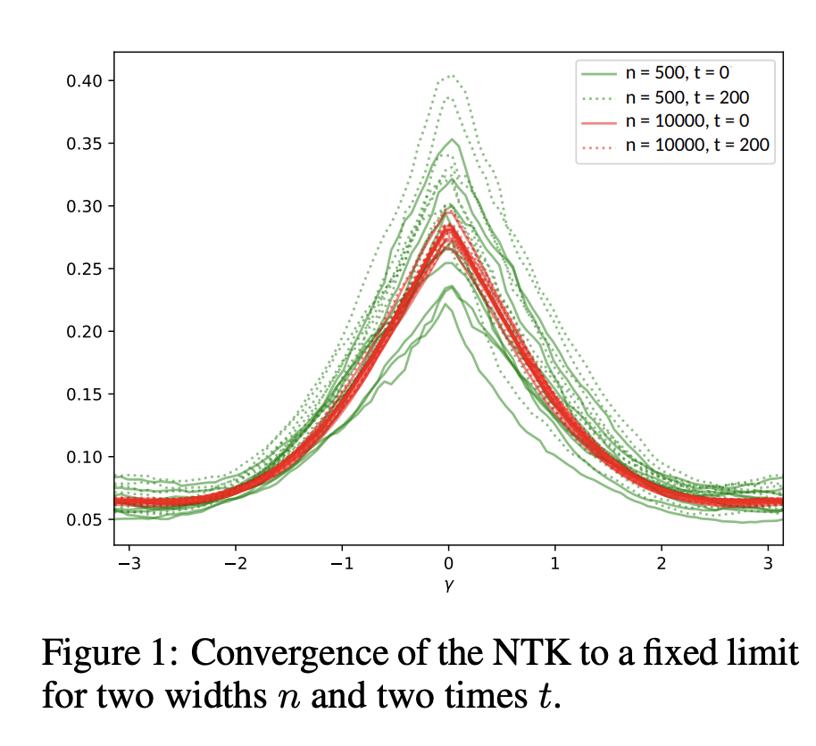
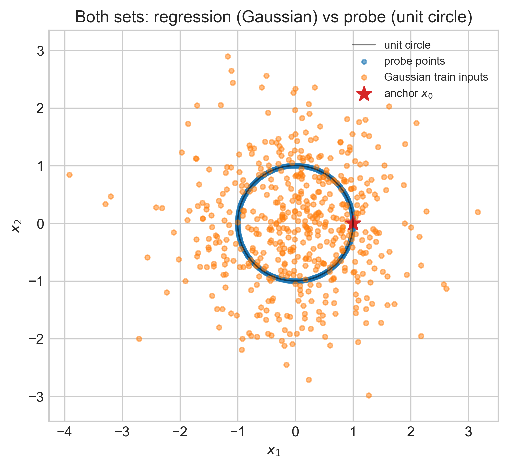
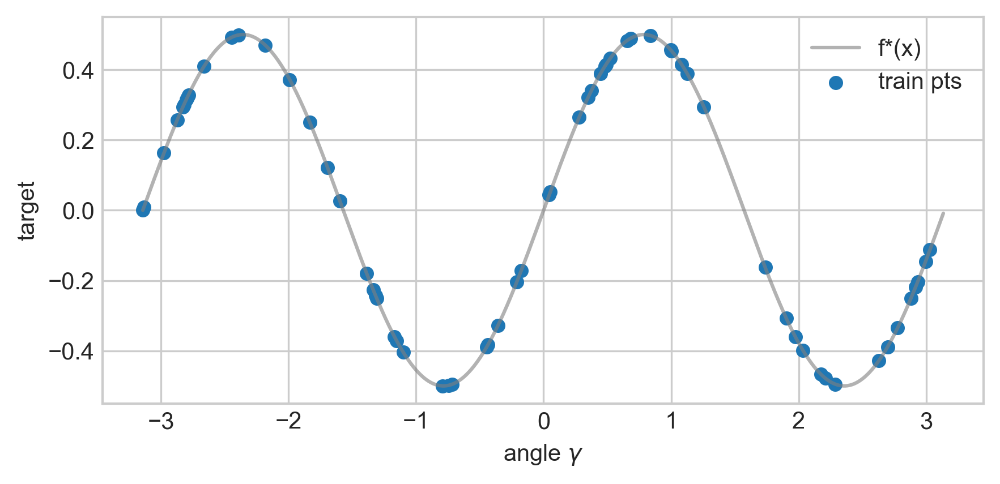
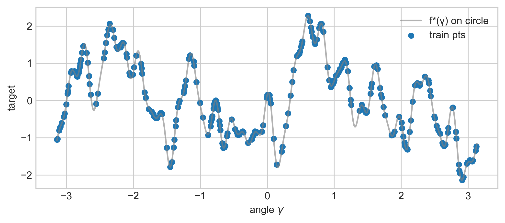
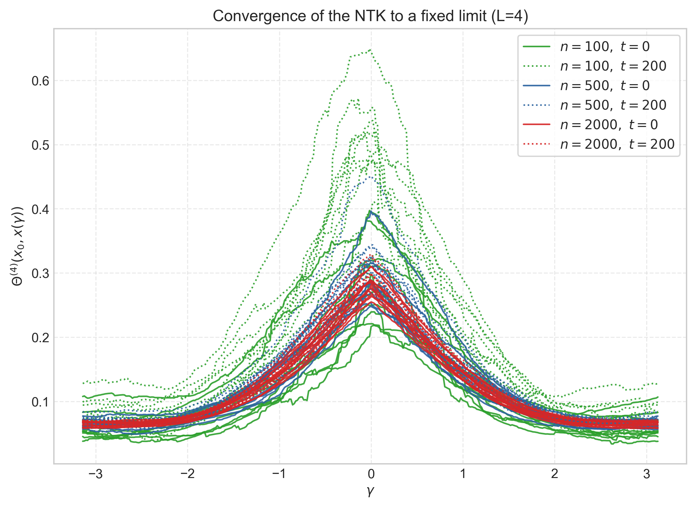
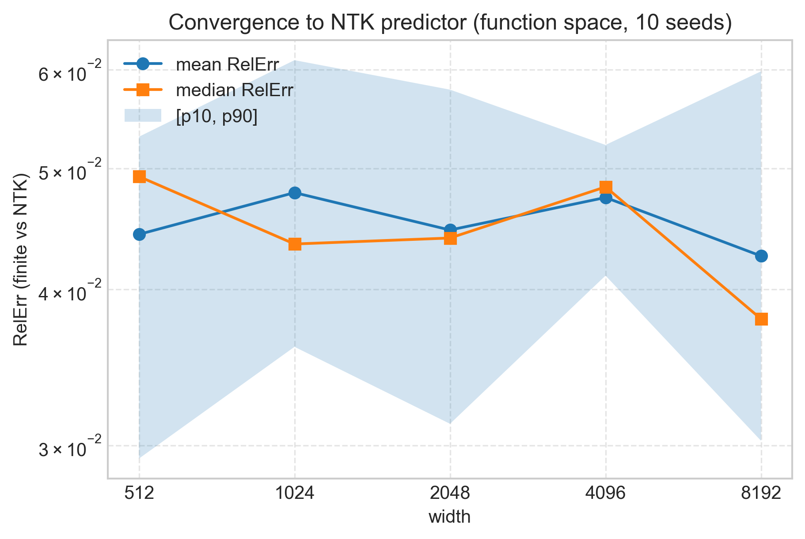
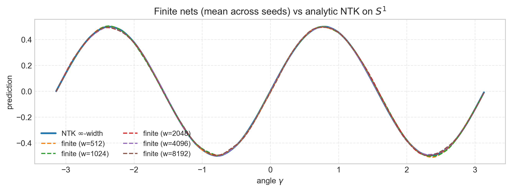
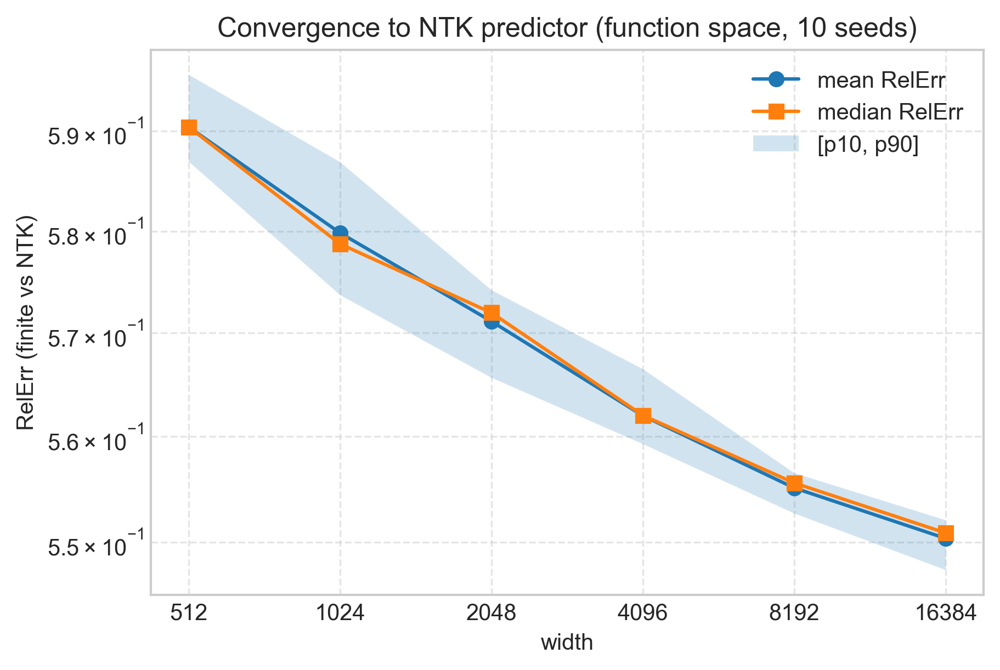
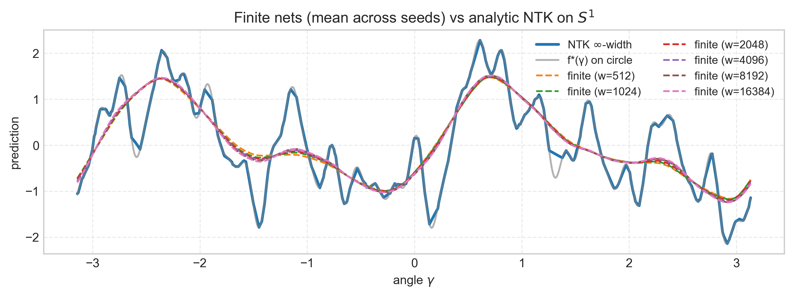

# Experiment EXP001 — Finite-width MLPs converge to NTK limit

**Date:** 2025-10-17  
**Script:** ntk-experiment.ipynb  
**Paper(s):** Neural Tangent Kernel: Convergence and Generalization in Neural Networks (https://arxiv.org/abs/1806.07572)

---

## 1 Goal

Finite-width MLPs converge to NTK limit

---

### Subgoals:

- Reproduce results from NTK paper for kernel profile showing low variance for kernel as width increases

---

## 2 Setup

### 2.1 Reproduction of NTK kernel profile:

- **Probe manifold: unit circle (2D).**  
  Use angles $\gamma \in [-\pi, \pi]$ and define

  $$
    x(\gamma)=\begin{bmatrix}\cos\gamma\\ \sin\gamma\end{bmatrix}\in\mathbb{R}^2.
  $$

  Build a dense grid $\Gamma=\{\gamma_i\}_{i=1}^{N}$ (e.g., $N=360$) and the probe set $X_{\text{circle}}=\{x(\gamma_i)\}$.
  Fix the **anchor** $x_0=(1,0)$.

- **Regression task used for training (separate from the probe).**  
  Draw inputs $x\sim\mathcal N(0,I_2)$ and set the target

  $$
    f^*(x)=x_1x_2.
  $$

  Train with mean-squared error on this Gaussian dataset. The circle is **only** for measuring/plotting the kernel.

  

- **Model (finite net).**  
  Fully-connected ReLU MLP in **NTK parameterization** with **depth \(L=4\)**
  Compare **two widths** $n\in\{500,\,2048\}$.

- **Training protocol.**  
  Full-batch gradient descent on the Gaussian regression for **200 steps** with **learning rate 1.0**.  
  Repeat for **10 random initializations** per width (to visualize variability across seeds).

- **What is plotted.**  
  The **empirical NTK** profile

  $$
    \gamma \;\mapsto\; \Theta^{(4)}_{\theta_t}\!\big(x_0,\;x(\gamma)\big)
  $$

  measured on the **unit circle** at two times:

  - **$t=0$** (initialization; solid lines),
  - **$t=200$** (after training; dotted lines).  
    Plot **all seeds** as thin curves for each width.

- **Expected observations.**  
  Variance across seeds **shrinks** as width increases (kernel concentrates to a deterministic limit).

---

### 2.2 Setup for function-space convergence on the unit circle

- **Inputs on the unit circle (2D).**  
  For angles $\gamma \in [-\pi, \pi)$,

  $$
    x(\gamma) = \begin{bmatrix}\cos\gamma \\ \sin\gamma\end{bmatrix} \in \mathbb{R}^2.
  $$

  Construct a dense grid $\Gamma = \{\gamma_i\}_{i=1}^N$ and the corresponding dataset $X_{\mathrm{eval}} = \{x(\gamma_i)\}_{i=1}^N$.

- **Targets (two variants).**  
  **(A) Simple baseline (paper-like):** $f^*(x)=x_1x_2$. On the circle this equals $\tfrac{1}{2}\sin(2\gamma)$ (a single low-frequency mode).  
  

  **(B) Harder mixture (to reveal convergence):**

  $$
    y(\gamma) = \sum_{k\in\mathcal K} a_k\,\sin\!\big(k\,\gamma+\phi_k\big) + \varepsilon,\quad
    \varepsilon \sim \mathcal N(0,\sigma^2),
  $$

  with $\mathcal K$ including higher frequencies (e.g., $\{2,4,7,11,16,23,32\}$), mildly decaying amplitudes $a_k$, and random phases $\phi_k \sim \mathrm{Unif}[0,2\pi)$.

  

  _Idea was to (Use (A) for a sanity check; use (B) to better see finite-width $\to$ NTK convergence.)_

- **Train/Test split on the circle.**  
  Select a **small, random** training subset $X_T=\{x(\gamma_{i_j})\}_{j=1}^{M}$ from $X_{\mathrm{eval}}$ (e.g., $M \in \{32, 64, 128, 256\}$).  
  Targets are $y_T = \{y(\gamma_{i_j})\}$.  
  Evaluate on the full grid $X_{\mathrm{eval}}$.

- **Model (finite net).**  
  Fully-connected ReLU MLP in **NTK parameterization**, depth $L = 1$ (Can try with $L=4$ but larger widths run out of memory), width $n$ swept over
  $\{64,128,256,512,1024,2048,4096,8192\}$.  
  **Loss:** MSE. **Optimizer:** full-batch GD/SGD with a small learning rate (e.g., $10^{-2}$) to approximate gradient flow; train to near-zero train MSE.

- **Analytic NTK (infinite width).**  
  Build the deterministic limit kernel using the **same architecture/activation/parameterization and init hyperparameters**.  
  **NTK predictor (kernel ridge):**

  $$
    \alpha=(K_{TT}+\lambda I)^{-1} y_T,\qquad
    \hat y_{\infty}(X)=K_{XT}\,\alpha,
  $$

  with small $\lambda$ (e.g., $10^{-6}$). $K_{TT}$ is the NTK gram matrix between the training points, $K_{XT}$ is the NTK gram matrix between the test points and the training points.

- **Across-seed robustness.**  
  For each width, repeat training over multiple random initializations (e.g., 10 seeds); summarize by median and percentile bands.  
  _(Seeds affect finite nets; not the analytic NTK limit.)_

---

## 4 Results

### 4.1 NTK profile reproduction

This serves as a sanity check for the code as well as the idea that as width starts increasing,
the kernel shows less variance eventually becomes constant as $width \to \infty$.

### 4.2 Convergence in function space

**Comparison in function space:**

- $\hat y_n(\gamma)$: Predictions of $n$-width network.
- Overlay $\hat y_n(\gamma)$ and $\hat y_{\infty}(\gamma)$ on $\gamma\in[-\pi,\pi)$.
- Record

  $$
    \mathrm{RelErr}(n)=\frac{\|\hat y_n-\hat y_{\infty}\|_2}{\|\hat y_{\infty}\|_2}.
  $$

- **Convergence:** As width $n$ increases, $\hat y_n \to \hat y_{\infty}$ and RelErr$(n)$ decreases.
- **Task difficulty:** The simple baseline $x_1x_2=\sin(\gamma)\cos(\gamma)=\tfrac12\sin(2\gamma)$ is **low-frequency** and easy; many widths will already match the NTK closely. The **harder mixture** (with higher modes and fewer train points) should make differences visible at small widths and highlights convergence as $n\uparrow$.
- **Optimization:** Full-batch GD best mirrors NTK gradient flow.

#### 4.2.1 Simple regression task

_Fig: Relative Error on simple regression task_

_Fig: Convergence on simple regression task_

### 4.2.2 Complex regression task

_Fig: Relative Error on complex regression task_

_Fig: Convergence on complex regression task_

## 5 Observations

- **Kernel-profile reproduction.**  
  The empirical NTK profile $\gamma \mapsto \Theta(x_0,x(\gamma))$ matches the paper's qualitative behavior:
  variance across random initializations **shrinks with width**, and the mild post-training "inflation" diminishes as width grows.

  _Takeaway:_ the kernel concentrates toward a deterministic limit and is nearly constant during training when wide.

- **Simple regression task ( $f^{\*}(x)=x_1x_2 = \tfrac12\sin 2\gamma$ on $S^1$ ).**  
  The **relative error (RelErr)** between finite nets and the analytic NTK predictor is **roughly flat** across widths (minor improvements only).  
  _Interpretation:_ this target is dominated by a **single low-frequency eigenmode** of the NTK on the circle, which small nets already capture well; finite-width corrections are tiny, so width yields little visible gain.

- **Complex regression task (Fourier mixture with higher modes).**  
  **RelErr decreases** monotonically (or near-monotonically) as width increases.  
  _Interpretation:_ higher-frequency components rely on smaller NTK eigenvalues and are **more sensitive** to finite-width effects; increasing width reduces these errors, revealing convergence toward the NTK limit.

- **Overlay plots (function space).**  
  For both tasks, the **finite-net predictions** look visually close for all widths; differences are subtle by eye.  
  _Note:_ The quantitative RelErr is the more sensitive indicator of convergence than visual overlays.

### Possible reasons the simple task shows little RelErr improvement

- The target is **too easy/low-rank** for the NTK on $S^1$; even narrow nets approximate the leading eigenfunction well.

---

## 6 Outcome

- **Validated NTK regime qualitatively:** kernel profiles reproduce the **concentration** ($\downarrow$ variance with width) and **near constancy** during training reported in the NTK paper.
- **Function-space convergence demonstrated:** on a **harder target** with higher Fourier content, the **RelErr** decreases with width, supporting convergence to the NTK predictor.

## 7 Next Steps

- Verify the weak-learning regime theory from Hanin-Nica (https://arxiv.org/pdf/1909.05989)
